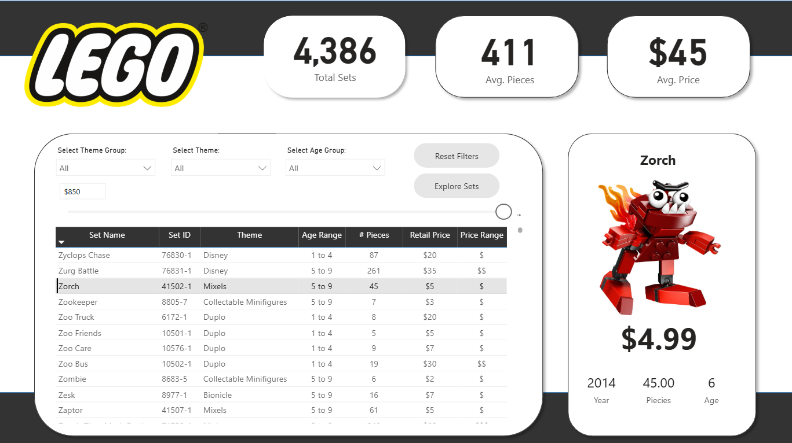
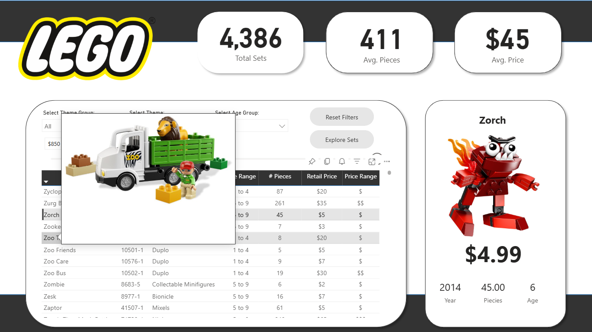
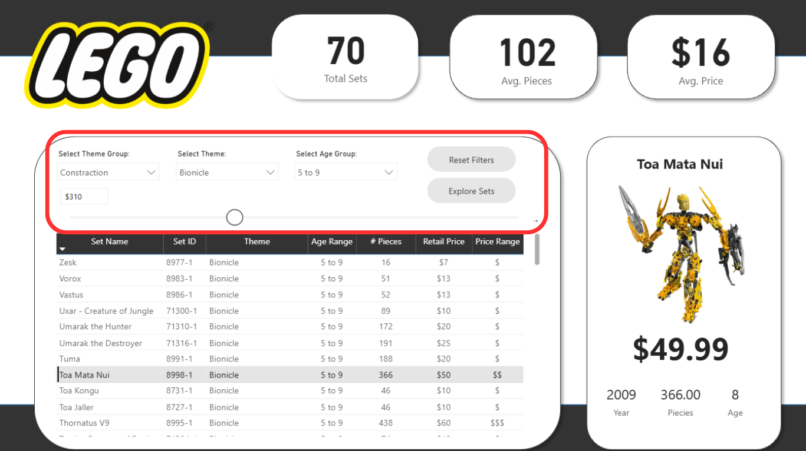
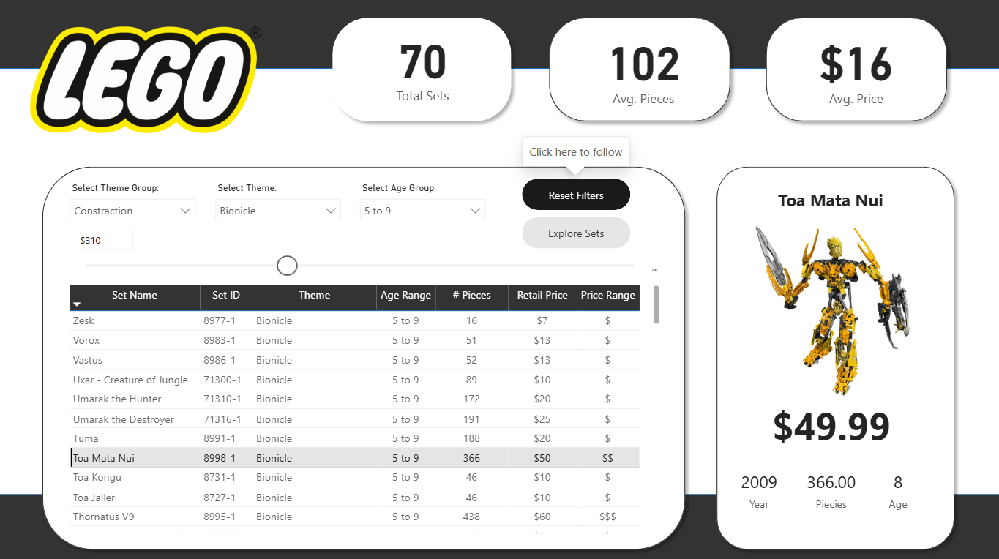
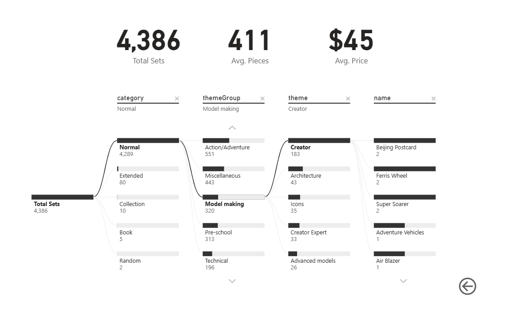

# LEGO Sets Dashboard | Power BI Project
*(Polish Version Below)*
## Project Overview
This project presents a fully interactive Power BI dashboard created using a LEGO sets dataset.  
The goal of the project was to clean the data, build meaningful KPIs, and design a professional and user-friendly analytical report.

---

## Interactive Dashboard
[View Interactive Dashboard](https://app.powerbi.com/reportEmbed?reportId=8514f10f-0e0b-4485-9682-d699ecc46337&autoAuth=true&ctid=164e1b0e-c8e5-41a9-9bbb-6f7ed40eef04)

---

## Dashboard Preview

---

## Project Workflow

### 1. Data Preparation (Power Query)
- Imported data from a CSV file
- Cleaned and transformed the dataset
- Removed unnecessary columns
- Corrected data types
- Filtered missing values

### 2. Feature Engineering
Created additional columns to improve analysis:
- Age categories
- Price categories

### 3. Data Modeling & DAX
Developed advanced DAX measures:
- Total number of LEGO sets
- Average price
- Number of pieces
- Context-aware KPI measures

### 4. Interactive Dashboard Design
Implemented advanced interactive features:
- Price filtering using parameters  
- Custom tooltips with product images  
- Dynamic cards reacting to filters  
- Bookmark-based **Reset Filters** button  
- Interactive filtering between visuals

### 5. AI Visualization
Used the **Decomposition Tree** visual to perform hierarchical analysis and discover key patterns in the LEGO dataset.

---

## Skills Demonstrated
**Power BI**
- Power Query
- DAX
- Data Modeling
- Interactive Dashboards

**Data Analysis**
- Data Cleaning
- KPI Development
- Exploratory Data Analysis (EDA)
- Business Logic Implementation

**Design**
- Dashboard UI/UX
- Visual hierarchy
- Professional layout

---

## Tools Used
- Power BI Desktop
- Power Query
- DAX
- CSV dataset
---

## Polish Version (Wersja Polska)

### Opis projektu
Projekt przedstawia interaktywny dashboard Power BI oparty na danych dotyczących zestawów LEGO.  
Celem projektu było przygotowanie danych, stworzenie wskaźników KPI oraz zaprojektowanie profesjonalnego i interaktywnego raportu.

### Zakres projektu

**Przygotowanie danych**
- Import danych z pliku CSV
- Czyszczenie danych
- Usuwanie zbędnych kolumn
- Korekta typów danych

**Modelowanie danych i DAX**
- Tworzenie miar obliczeniowych
- KPI
- Dynamiczna logika raportu

**Interaktywność**
- Parametry filtrowania
- Tooltips ze zdjęciami
- Bookmarks (reset filtrów)
- Interaktywne wizualizacje

---

## Author
*Ilona Shandrokha*
